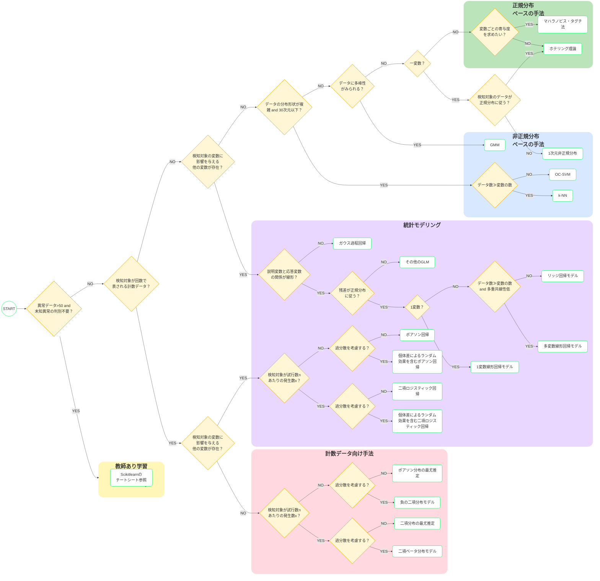

# まるごと学べる 異常検知の実践知

書籍『[まるごと学べる 異常検知の実践知](https://gihyo.jp/book/2025/978-4-297-15226-0)』(技術評論社発行)のサポートページです。書籍中のソースコードや、書面に掲載されていない補足解説をまとめています。

## サポートページの構成

本サポートページは、以下のコンテンツを含んでいます。

|項目|概要|
|---|---|
|[**異常検知アルゴリズム チートシート**]()|書籍に記載した手法から適切なものを選ぶためのフローチャート|
|[**ソースコード**]()|書籍中のソースコード（Jupyter）|
|[**付録解説**]()|書面に掲載されていない、各種理論やアルゴリズムに関する補足解説|
|[**正誤表**]()|書籍の正誤表|

## 異常検知アルゴリズム チートシート

異常検知アルゴリズムを選択するためのフローチャートです（画像、時系列データが対象の手法は含まず）。

※ 本チートシートをブラッシュアップしていきたいので、改善提案があればIssuesに書き込んで頂けるとありがたいです

## ソースコード

[環境構築方法]()

本文中で解説したソースコード

|章|手法名|書籍中のページ|
|---|---|---|
|2|[**データの可視化とEDA**]()||
|2|[**教師なし学習向けトイデータ生成**]()||
|3|[**SVM**]()||
|3|[**ロジスティック回帰**]()||
|4|[**1変数のホテリング理論**]()||
|4|[**1次元非正規分布**]()||
|5|[**二項分布の最尤推定**]()||
|5|[**ポアソン分布の最尤推定**]()||
|6|[**多変数のホテリング理論とマハラノビス・タグチ法**]()||
|6|[**混合正規分布モデル（GMM）**]()||
|6|[**k-NN**]()||
|7|[**統計モデリング向けトイデータ生成**]()||
|7|[**1変数線形回帰モデル**]()||
|7|[**多変数線形回帰モデル**]()||
|7|[**リッジ回帰モデル**]()||
|7|[**ガンマ回帰（非正規GLM）モデル**]()||
|8|[**ベイズ線形回帰モデル**]()||
|8|[**二項ロジスティック回帰モデル**]()||
|8|[**ランダム効果を含む二項ロジスティック回帰モデル**]()||
|9|[**各種前処理**]()||
|9|[**評価指標の算出**]()||
|9|[**交差検証**]()||

付録（本文中で解説していないコード）

|関連する章|手法名|書籍中のページ|
|---|---|---|
|5|[**二項ベータ分布モデル（過分散付き二項分布）**]()||
|5|[**負の二項分布モデル（過分散付きポアソン分布）**]()||
|6|[**OC-SVM**]()||
|7|[**ガウス過程回帰**]()||
|8|[**ポアソン回帰モデル**]()||
|8|[**グループ差を含むGLMM**]()||

## 付録解説

|書籍中のページ|中分類||
|---|---|---|
||||
||||
||||

## 正誤表
