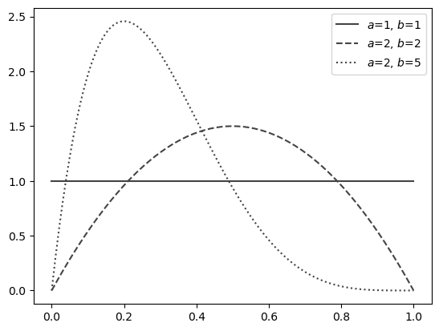

# 過分散のある二項分布モデル（ベータ二項分布モデル）

工業製品のロットあたりの不良品数や時間あたりの故障発生数、野球の安打数のような**計数データ**（count data）をモデリングするには、対象とする現象に応じて以下のように二項分布・ポアソン分布を使い分けます。

|確率分布名|モデリング対象の現象|例|
|---|---|---|
|二項分布| $n$ 回試行した際の発生数 $x$ |ロットあたり不良品数、野球の安打数|
|ポアソン分布|面積・時間 $t$ あたりの発生数 $x$ |機械の時間あたり故障発生数、面積あたり雑草発生数|

このような**二項分布、ポアソン分布を用いた計数データのモデリング**は、現象の**発生確率**（二項分布では成功確率パラメータ $\mu$ 、ポアソン分布では単位区間あたり平均発生数パラメータ $\mu$ ）**が一定であることを前提**としています。
発生確率が一定でない場合、以下の図に示すようにデータのばらつきが二項分布・ポアソン分布が予測するよりも大きくなる、**過分散**（overdispersion）と呼ばれる現象が発生します。


過分散が発生している場合、二項分布・ポアソン分布をそのまま使用すると、データの挙動を精度よくモデリングすることができません。代わりに以下のようにベータ二項分布、負の二項分布を用いることで、過分散を考慮したモデリングを実現できます。

- 過分散を含む二項分布：**ベータ二項分布**
- 過分散を含むポアソン分布：**負の二項分布**

ここでは $n$ 回試行した際の発生数 $x$ に過分散が発生しているケースに、ベータ二項分布による異常検知を適用する方法を解説します。

## ベータ二項分布による過分散のモデリング

$n$ 回試行した際の発生数 $x$ のモデリングには、過分散を考慮しない場合は二項分布を用います。過分散を考慮する場合は、二項分布の代わりに**ベータ二項分布**（beta-binomial distribution）を用います。

### 二項分布における過分散発生の実例

二項分布を用いたモデリングでの過分散の有無について、身近な例を使って考えてみましょう。

たとえば野球の打率やバスケットボールのスリーポイントシュート成功率は、選手によって能力差があるため、選手ごとに成功確率が異なります。このように、観測単位ごとに成功確率が揺らぐ状況では、二項分布が仮定する「成功確率が一定」という前提が破れるため、結果として**過分散**が発生します。実際、現実に得られる計数データの多くでは、程度の差はあれ過分散が観測されることが多いと報告されています。

一方で[こちらのサンプルコード](https://github.com/ghmagazine/python_anomaly_detection_book/blob/main/notebooks/ch5_3_Binomial_Anomaly_Detection.ipynb)でも示したように、「ある選手の打率やスリーポイントシュート成功率がリーグ平均より高いか」を検証したい場合には、成功確率がリーグ平均で一定であると仮定し、その仮定からの差異を検出するようモデルを構築します。このように、モデリングで過分散を考慮するかどうかは、実際に過分散が存在するかどうかだけでなく、分析の目的や前提とする仮説によっても決められるべきものです。

別の例として、工業製品のロットあたり不良数を異常検知するケースを考えます。ロットあたりの製品生産数を $n$ 、うち不良品数を $x$ としたとき、不良品数 $x$ は二項分布 $Bi(x \mid n, \mu)$ に従うと仮定できます。このとき、不良の発生率 $\mu$ がすべてのロットで一定であれば過分散はなく、ロットによって $\mu$ が変動していれば過分散が生じます。よくコントロールされた生産工程では $\mu$ がほぼ一定である場合もあれば、外的影響を受けやすい工程では $\mu$ が大きく変動することもあり得るため、ドメイン知識だけから過分散の有無を判断するのは一般に困難です。したがって、**過分散の有無はデータから統計的に判定することが望ましい**と言えるでしょう。過分散の具体的な判定方法は[後述します](https://github.com/ghmagazine/python_anomaly_detection_book/blob/main/appendix_notes/5_3_Beta_Binomial.md#%E9%81%8E%E5%88%86%E6%95%A3%E3%81%AE%E6%9C%89%E7%84%A1%E3%82%92%E3%83%87%E3%83%BC%E3%82%BF%E3%81%8B%E3%82%89%E5%88%A4%E5%AE%9A%E3%81%99%E3%82%8B%E6%96%B9%E6%B3%95)。

### ベータ二項分布モデルの概要

ベータ二項分布モデルは、二項分布の成功確率（発生率）パラメータ $\mu$ がベータ分布 $Be(\mu \mid \alpha,\beta)$ に従う、以下の式で表されるモデルです。 $\mu$ が一定ではなく確率的に変動するため、過分散を表現することができます。

```math
\begin{aligned}
\mu &\sim Be(\alpha,\beta) \\
x &\sim Bi(n, \mu)
\end{aligned}
\tag{8.101}
```

ベータ分布の確率密度関数は、以下の式で表されます。

```math
\begin{aligned}
Be(\mu \mid \alpha,\beta)
&=
\frac{\Gamma(\alpha+\beta)}{\Gamma(\alpha)\Gamma(\beta)} \mu^{\alpha-1}(1-\mu)^{\beta-1} \\
&=
\frac{\mu^{\alpha-1}(1-\mu)^{\beta-1}}{B(\alpha,\beta)}
\end{aligned}
\tag{8.102}
```

ただし、 $B(\alpha,\beta)$ はベータ関数 $B(\alpha,\beta)=\frac{\Gamma(\alpha)\Gamma(\beta)}{\Gamma(\alpha+\beta)}$ を、 $\Gamma(\cdot)$ はガンマ関数を表します。

ベータ分布はパラメータ $\alpha,\beta$ を持ちます。以下の図は、パラメータ $\alpha,\beta$ を変えてプロットした確率密度関数です。



確率密度関数の範囲（台）が $[0,1]$ の範囲に収まることから、0未満や1より大きな値をとらないという制約条件をもつ、確率のモデリングに適していることがわかります。また $\alpha=1,\beta=1$ のベータ分布は、 $[0,1]$ の範囲内でとる確率が等しい一様分布となります。

### ベータ二項分布モデルの予測分布

ベータ二項分布モデルの確率質量関数、すなわち予測分布 $p(x \mid n,\alpha,\beta)$ は、二項分布モデルのパラメータ $\mu$ の全てのとりうる値を考慮するために、その確率密度関数をかけて積分消去（周辺化）することで求められます。

```math
\begin{aligned}
p(x \mid n,\alpha,\beta)
&=
BetaBin(x \mid n,\alpha,\beta) \\
&=
\int_0^1 Bi(x \mid n, \mu) Be(\mu \mid \alpha,\beta) d\mu \\
&=
\binom{n}{x}\frac{B(x+\alpha,n-x+\beta)}{B(\alpha,\beta)}
\end{aligned}
\tag{8.103}
```

### ベータ二項分布モデルの最尤推定

ベータ二項分布モデルの最尤推定では、ベータ分布のパラメータ $\alpha,\beta$ が推定対象となります。

書籍中の対数尤度の式 (4.20)と、予測分布の式 (8.103)をまとめると、ベータ二項分布モデルの対数尤度は以下のように表されます。

```math
\begin{aligned}
\log L(\boldsymbol{X} \mid \boldsymbol{n},\alpha,\beta)
&=
\log \prod_{i=1}^N p(x^{(i)} \mid n^{(i)},\alpha,\beta) \\
&=
\sum_{i=1}^N \log \bigg( \binom{n^{(i)}}{x^{(i)}}\frac{B(x^{(i)}+\alpha,n^{(i)}-x^{(i)}+\beta)}{B(\alpha,\beta)} \bigg) \\
&=
\sum_{i=1}^N \bigg(\log \binom{n^{(i)}}{x^{(i)}} + \log B(x^{(i)}+\alpha,n^{(i)}-x^{(i)}+\beta) - \log B(\alpha,\beta) \bigg)
\end{aligned}
\tag{8.104}
```

この式の最大化は基本的には解析的に解けないため、各種**数値最適化**アルゴリズムを使用して対数尤度を最大化するように $\alpha,\beta$ の値を探索することが一般的です。

## ベータ二項分布モデルによる異常検知の実施手順

　ベータ二項分布モデルの最尤推定による異常検知の手順を、学習と推論に分けて紹介します。

### 学習ステップ1. 正常のモデルを作成する

　正常のモデルとして、正常データ（学習データ）に対して当てはまりのよいベータ二項分布を求めます。具体的には、パラメータ $\alpha,\beta$ の最尤推定値 $\hat{\alpha},\hat{\beta}$ を学習データを用いた数値最適化により求めます。

### 学習ステップ2. 異常を表す指標（異常度）を定義する

1章の定義に従うのであれば、最尤推定で求めたパラメータ $\hat{\alpha},\hat{\beta}$ と式 (8.103)から求めた負の対数尤度

```math
\begin{aligned}
a(x,n)
&=
- \log p(x \mid n,\hat{\alpha},\hat{\beta}) \\
&=
- \log BetaBin(x \mid n,\hat{\alpha},\hat{\beta}) \\
&=
- \log \bigg( \binom{n}{x}\frac{B(x+\hat{\alpha},n-x+\hat{\beta})}{B(\hat{\alpha},\hat{\beta})} \bigg) \\
&=
- \log \binom{n}{x} - \log B(x+\hat{\alpha},n-x+\hat{\beta}) + \log B(\hat{\alpha},\hat{\beta})
\end{aligned}
\tag{8.105}
```

　を異常度として用いたいところですが、通常の二項分布と同様に、 $n$ が⼩さい場合の確率質量が全体的に⼤きくなる現象が発生します。この問題を防ぐために、異常度 $a(x,n)$ は用いず、ベータ二項分布の累積分布関数に基づき $x$ に直接しきい値を設ける方法をとります。

### 学習ステップ3. しきい値を設ける

　変数 $x$ に直接しきい値を設ける方法を考えます。正常データにおいて、この $x$ はステップ1で求めた $\hat{\alpha},\hat{\beta}$ を式 (8.103)に代入して得られたベータ二項分布

```math
\begin{aligned}
BetaBin(x \mid n,\hat{\alpha},\hat{\beta})
\end{aligned}
\tag{8.106}
```

　に従います。よってベータ二項分布の累積分布関数とターゲットとする誤報率に基づき、上下両方向にしきい値を設けると良いでしょう。

　例えばターゲットとする誤報率として $0.0027$ を採用する場合、パラメータ $\hat{\alpha},\hat{\beta}$ 、試行数 $n$ のベータ二項分布の累積分布関数の逆関数に $0.0027 \div 2 = 0.00135$ を入力した値

```math
\begin{aligned}
x_{thl}=BetaBin_{CDF}^{-1} (0.00135 \mid n,\hat{\alpha},\hat{\beta})
\end{aligned}
\tag{8.107}
```
　
　を下側しきい値として、

```math
\begin{aligned}
x_{thh}=BetaBin_{CDF}^{-1} (1-0.00135 \mid n,\hat{\alpha},\hat{\beta})
\end{aligned}
\tag{8.108}
```
　
　を上側しきい値として用います。これらのしきい値は推論データの試行数 $n$ を含むため、学習時点では求められません。よって推論時に都度求める必要があります。

### 推論手順
　
　推論時は、学習時に最尤推定で求めたパラメータ $\hat{\alpha},\hat{b}$ 、および推論データの試行数 $n$ を用いて、以下手順で異常の有無を判定します。

- 学習ステップ3で定義した式 (8.107)および式 (8.108)に基づき、上側しきい値と下側しきい値を求める
- 推論データ $x$ が下側しきい値以下または上側しきい値以上であれば異常あり、そうでなければ異常なしと判定する

## ベータ二項分布モデルによる異常検知の実装

　先ほどの学習手順、推論手順に基づいた異常検知を、Pythonで実装してみます。

今回はモデリングの対象として、書籍の5章でも使用したスリーポイントシュート成功率のデータ[^nba_stats]を使用します。

```csv
PLAYER_ID,AGE,FG3M,FG3A
203932,23.0,121,347
1628988,22.0,43,127
1627846,25.0,32,100
201143,33.0,73,203
202329,28.0,96,280
 :
```

`FG3A`列がスリーポイントシュートの試投数 $n$ を、`FG3M`列が成功数 $x$ を表しており、2022年度のデータを学習データ、2023年度のデータを推論データとして用います。

過分散を考慮しない二項分布モデルでは、「平均的な選手よりも偶然の範囲を超えて成功率が高い選手」の検出を目的としていましたが、過分散を考慮するベータ二項分布モデルでは、「**個人差を考慮した上で、偶然の範囲を超えて成功率が高い選手**」を検出することができます。

[^nba_stats]:https://www.nba.com/stats/players/traditional

### 学習

学習フェーズでは、最尤推定による確率分布パラメータの推定を実施します。

SciPyにはベータ二項分布を実装するためのクラス`scipy.stats.betabinom`が用意されていますが、残念ながら最尤推定を実行するための`fit`メソッドが準備されていません。よってまずは以下のように、SciPyの数値最適化用メソッド`scipy.optimize.minimize`関数を用いて、最尤推定を実行する関数を実装します。
　
: コード 8.102 | ベータ二項分布の最尤推定を実行する関数

```python
import numpy as np
from scipy.stats import betabinom
from scipy.optimize import minimize

def betabinom_neg_log_likelihood(params, x, n):
    """ベータ二項分布の負の対数尤度を計算する関数（数値最適化の目的関数）"""
    alpha, beta = params
    # パラメータa,bは正の値でなければならない
    if alpha <= 0 or beta <= 0:
        return np.inf
    # 確率質量関数の対数の和（データ全体の対数尤度）を計算
    log_pmf_sum = betabinom.logpmf(x, n, alpha, beta).sum()
    # 負の対数尤度を返す
    return -log_pmf_sum

def betabinom_mle(x, n, initial_params=(1.0, 1.0)):
    """ベータ二項分布の最尤推定を実行する関数"""
    result = minimize(
        betabinom_neg_log_likelihood,
        initial_params,
        args=(x, n),
        method='L-BFGS-B',  # 数値最適化のアルゴリズム（L-BFGS-B）
        bounds=[(1e-5, None), (1e-5, None)]  # パラメータalpha,betaは正の値
    )
    if result.success:
        return result.x  # 最適化されたパラメータalpha,betaを返す
    else:
        raise RuntimeError("最尤推定が収束しませんでした。")
```

この関数を用いて、2022年度のデータを読み込んで最尤推定を実施します。
　
: コード 8.103 | ベータ二項分布の最尤推定による異常検知の実装例（学習）

```python
import pandas as pd

###### 学習データの読込と前処理 ######
# スリーポイントシュート成功率データ
df_train = pd.read_csv('./../datasets/player_stats_2022.csv')
df_train = df_train[df_train['FG3A'] > 0] # 試投数0を除外
# 学習データの成功数x、試行数nを別々に保持してndarray化
x_train = df_train['FG3M'].to_numpy()
n_train = df_train['FG3A'].to_numpy()

###### 学習ステップ1. 正常のモデルを作成する ######
# ベータ二項分布の最尤推定を実行
alpha, beta = betabinom_mle(x_train, n_train)

###### 学習ステップ2. 異常を表す指標（異常度）を定義する ######
# 式を定義するのみでプログラム上は処理を実施しない

###### 学習ステップ3. 異常度にしきい値を設ける ######
# 推論時に都度算出するので、学習時はしきい値を求めない

###### 学習で求めたパラメータを表示 ######
print(f"alpha={alpha}, beta={beta}")
```

　実行結果

```console
alpha=100.56908050114423, beta=188.942229218715
```

　推定したパラメータ $\hat{\alpha},\hat{\beta}$ に基づき、発生率パラメータ $\mu$ が従うベータ分布の確率密度関数を可視化すると、以下のようになります。


　
　$\mu$ がある程度広がりをもった分布に従っていることが分かります。この広がりが過分散であり、今回のケースでは（真の）スリーポイントシュート成功率の個人差に相当します。このような過分散を考慮したモデルを使用して異常検知を実施することで、二項分布のばらつきだけでなく、個人の能力のばらつきの範囲を超えて成功率が高い選手を検出することができます。

### 推論

　学習フェーズで推定したパラメータ $\hat{\alpha},\hat{\beta}$ と推論データの試投数 $n$ を用いて、式 (8.107)および式 (8.108)から上下のしきい値を求め、推論データのシュート成功数 $x$ に対して異常判定を行います。
　
: コード 8.104 | ベータ二項分布の最尤推定による異常検知の実装例（推論）

```python
from scipy import stats

###### 学習したパラメータをここに記載
ALPHA = alpha  # パラメータalpha
BETA = beta    # パラメータbeta

###### 推論データの読み込みと前処理######
# 2023年度のスリーポイントシュート成功率データを推論データとする
df_inference = pd.read_csv("./../datasets/player_stats_2023.csv")
# 試投数5以下を除外（表示の都合上）
df_inference = df_inference[df_inference["FG3A"] > 0]
n_inference = df_inference["FG3A"].to_numpy() # 推論対象の試投数n
x_inference = df_inference["FG3M"].to_numpy() # 推論対象の成功数x

###### 推論を実行######
TARGET_FP_RATE = 0.0027 # ターゲットとする誤報率（正規分布の3σ相当=0.0027）
# 下側しきい値（ベータ二項分布の累積分布関数から計算）
th_lowers = stats.betabinom.ppf(TARGET_FP_RATE/2, n=n_inference, a=ALPHA, b=BETA)
# 上側しきい値（ベータ二項分布の累積分布関数から計算）
th_uppers = stats.betabinom.ppf(1 - TARGET_FP_RATE/2, n=n_inference, a=ALPHA, b=BETA)
# しきい値により異常の有無を判定
pred = np.where((x_inference < th_lowers) | (x_inference > th_uppers),
                "anomaly", "normal")
# 推論結果を表示（しきい値を超えた選手）
df_inference["3P%"] = x_inference / n_inference # 成功率
df_inference["prediction"] = pred
print(df_inference[df_inference["prediction"] == "anomaly"][
      ["PLAYER_ID", "3P%", "FG3A", "FG3M"]].sort_values(
      "3P%", ascending=False).reset_index(drop=True))
```

判定のしきい値を超えた選手の一覧をリストアップします。

```console
   PLAYER_ID       3P%  FG3A  FG3M
0    1628379  0.494424   269   133
```

検出された`PLAYER_ID`が1628379の選手は、2022年シーズンの選手のばらつきから推測される偶然の範囲を超えて（発生率0.0027以下）、スリーポイントシュート成功率が高いと言えるでしょう。

　推論の結果、異常と判定される範囲を推論データと重ねて可視化します。横軸`FG3A`は試投数 $n$ 、縦軸`3P%`は成功率 $\frac{x}{n}$ を表します。背景の塗りつぶし色が明るい部分が正常判定、暗い部分が異常判定される範囲を表します。重ねてプロットしている散布図が推論データを、異常判定された選手を黒点で示しています。


　
　比較対象として、過分散を考慮しない二項分布モデルでの異常判定の範囲（書籍中の図5.5）を以下に示します。


二項分布モデルと比べ、過分散を考慮したベータ二項分布モデルは、ベータ分布由来のばらつき（過分散）が加わって予測分布の分散が⼤きくなり、正常判定の範囲が広がったことがわかります。

## 過分散の有無をデータから判定する方法

過分散の判定には、「実際のデータの分散」と「過分散がない場合の理論上の分散」の比率を用いるのが直感的でしょう。

「実際のデータの分散」、すなわち標本分散は、以下のように求められます。

```math
\begin{aligned}
s_{obs}
&=
\hat{\sigma}^2=\frac{1}{N} \sum_{i=1}^N (x^{(i)}-\bar{x})^2 \\
\bar{x}
&=
\frac{1}{N} \sum_{i=1}^N x^{(i)}
\end{aligned}
\tag{8.109}
```

試行数$n$、発生率パラメータ$\mu$の二項分布の分散は$n\mu(1-\mu)$で表されるため、$i$番目のデータの「過分散がない場合の理論上の分散」は以下の式で表されます（$\hat{\mu}$は$\mu$の最尤推定値）。

```math
\begin{aligned}
s_{theory}^{(i)}
&=
n^{(i)}\hat{\mu}(1-\hat{\mu}) \\
\hat{\mu}
&=
\frac{\sum_{i=1}^N x^{(i)}}{\sum_{i=1}^N n^{(i)}}
\end{aligned}
\tag{8.110}
```

しかし、この $n^{(i)}$ は多くの場合試行 $i$ ごとに異なるため、データ全体での理論分散 $s_{theory}$ は単純な計算では求めることができません。よってより**試行数** $n$ **が一定でない場合**は、後述の**ピアソンのカイ二乗統計量と自由度の比率**を用いることが一般的です。

なお、試行数 $n$ が一定の場合は、以下の方法で簡易的に過分散を判定できます。

- 実測分散 $s_{obs}$ と理論分散 $s_{theory}=n\hat{\mu}(1-\hat{\mu})$ の比率 $\frac{s_{obs}}{s_{theory}}$ が1より一定以上大きければ過分散ありとみなす
- あるいは、発生率 $\mu^{(i)}=\frac{x^{(i)}}{n^{(i)}}$ の分散の実測値 $\mu_{obs}=\mathrm{Var}(\mu^{(i)})=\frac{1}{N} \sum_{i=1}^N (\mu^{(i)}-\bar{\mu})^2$ （ただし、 $\bar{\mu}=\hat{\mu}=\frac{\sum_{i=1}^N x^{(i)}}{\sum_{i=1}^N n^{(i)}}$ ）と、理論値 $\mu_{theory}=\frac{\hat{\mu}(1-\hat{\mu})}{N}$ の比率 $\frac{\mu_{obs}}{\mu_{theory}}$ が1より一定以上大きければ過分散ありとみなす

### ピアソンのカイ二乗統計量を用いた過分散の判定

ピアソンのカイ二乗統計量 $X^2$ は、以下のように定義されます。

```math
\begin{align}
X^2 = \sum_{i=1}^N \frac{(x^{(i)} - \hat{\mu}^{(i)})^2}{V[\hat{\mu}^{(i)}]}
\end{align}
\tag{8.111}
```

分子の $x^{(i)}$ は変数 $x$ の実測値、 $\hat{\mu}^{(i)}$ はモデルが予測した変数 $x$ の理論上の平均を表し、二項分布の場合は $\hat{\mu}^{(i)}=n^{(i)}\hat{\mu}=n^{(i)}\frac{\sum_{i=1}^N x^{(i)}}{\sum_{i=1}^N n^{(i)}}$ となります。

分母の $V[\hat{\mu}^{(i)}]$ は、変数 $x$ が従う確率分布の理論上の分散で、二項分布では $n^{(i)}\hat{\mu}(1-\hat{\mu})$ となります。

以上まとめると $X^2$ は「理論分散で標準化された変数 $x$ の残差の二乗和」と解釈でき、データ全体での分散の大きさを理論値で標準化したものとみなせます。二項分布では $X^2$ は以下の式で表されます。

```math
\begin{align}
X^2 = \sum_{i=1}^N \frac{(x^{(i)} - n^{(i)}\hat{\mu})^2}{n^{(i)}\hat{\mu}(1-\hat{\mu})}
\end{align}
\tag{8.112}
```

過分散がなければ、このピアソンのカイ二乗統計量 $X^2$ と、モデルの自由度 $N-1$ （データ数 $N-$ パラメータの個数 $1$ ）の比率

```math
\begin{align}
\hat{D} = \frac{X^2}{N-1}
\end{align}
\tag{8.113}
```

は、1になります。よってこの $\hat{D}$ が1より一定以上大きければ、過分散ありとみなして良いでしょう。

過分散ありとみなす $\hat{D}$ のしきい値には決まった値があるわけではないですが、経験的には1.5や2.0という値がよく用いられています（[例](https://sites.google.com/view/ynomura/stats/overdispersion)）。

### 過分散の有無判定のPythonによる実装

ピアソンのカイ二乗統計量 $X^2$ を用いた過分散判定を、Pythonで実装する方法を解説します。
　
: コード 8.101 | 二項分布モデルの過分散の判定

```python
import pandas as pd
import numpy as np

###### 学習データの読込と前処理 ######
# スリーポイントシュート成功率データ
df_train = pd.read_csv('./../datasets/player_stats_2022.csv')
df_train = df_train[df_train['FG3A'] > 0] # 試投数0を除外
# 学習データの成功数x、試行数nを別々に保持してndarray化
x_train = df_train['FG3M'].to_numpy()
n_train = df_train['FG3A'].to_numpy()

###### ピアソンのカイ二乗統計量を用いて過分散の有無を判定 ######
mu = np.sum(x_train) / np.sum(n_train)  # 発生率パラメータμの最尤推定量
chi2 = np.sum((x_train - n_train * mu) ** 2 / (n_train * mu * (1 - mu)))  # ピアソンのカイ二乗統計量
dfree = len(x_train) - 1  # 自由度
overdispersion_ratio = chi2 / dfree  # 過分散比D
print(f'ピアソンのカイ二乗統計量: {chi2:.2f}')
print(f'自由度: {dfree}')
print(f'過分散比 D: {overdispersion_ratio:.2f}')
```

## 参考：ベータ二項分布モデルと二項分布のベイズ推定

実はベータ二項分布は、発生率（成功確率）パラメータ $\mu$ の事前分布をベータ分布として、二項分布をベイズ推定した場合の予測分布でもあります。

ベータ二項分布モデルのベータ分布は、発生率パラメータ $\mu$ の変動により過分散を明示的に表現することを目的として、モデルに導入されていました。一方でベイズ推定の事前分布は、発生率パラメータ $\mu$ の事前知識のあいまいさを表現することを目的としており、過分散を明示的に表現しているわけではありません。すなわちこの2種類のモデルは、予測分布の確率分布の種類は同じだが、ベータ分布の導入目的が異なると言えるでしょう。

二項分布のベイズ推定を具体的に見ていきます。二項分布

```math
\begin{aligned}
x &\sim Bi(n, \mu)
\end{aligned}
\tag{8.114}
```

において、発生率パラメータ $\mu$ の共役事前分布としてベータ分布 $Be(\mu \mid \alpha,\beta)$ を採用した場合を考えます。
　
　このとき、 $\mu$ の事前分布が共役事前分布であることから、事後分布もベータ分布となり、以下のように求まります。

```math
\begin{aligned}
p(\mu \mid \boldsymbol{n}, \boldsymbol{X})=Be(\mu \mid \alpha+m,\beta+l)
\end{aligned}
\tag{8.115}
```
　
　ただし、 $m$ は学習データ中の発生数 $x$ の合計、 $l$ は試行数 $n$ の合計 $-$ 発生数 $x$ の合計を示し、以下のように表されます。

```math
\begin{aligned}
m
&=
\sum_{i=1}^N x^{(i)} \\
l
&=
\sum_{i=1}^N n^{(i)} - m
\end{aligned}
\tag{8.116}
```

　このとき、予測分布は以下のように求まります

```math
\begin{aligned}
p(x \mid n,\boldsymbol{X})
&=
\int p(x \mid n, \mu) p(\mu \mid \boldsymbol{n}, \boldsymbol{X}) d\mu \\
&=
\int Bi(x \mid n, \mu) Be(\mu \mid \alpha+m,\beta+l) d\mu
\end{aligned}
\tag{8.117}
```

　この予測分布は式(8.103)と同じ形のベータ分布と二項分布の合成分布、すなわちベータ二項分布 $BetaBin(x \mid n,\alpha+m,\beta+m)$ となっています。データが増えて $m,n$ が大きくなるほど、ベータ分布の分散は小さくなるため、データ不足による推定のあいまいさ（分散）がデータが増えるごとに縮小していくことが式からも確認できます。
　このように二項分布のベイズ推定では、データが増えると予測分布が通常の二項分布に収束していくため、データの多寡とは無関係に発生している過分散を表現することはできないので、ご注意ください。
