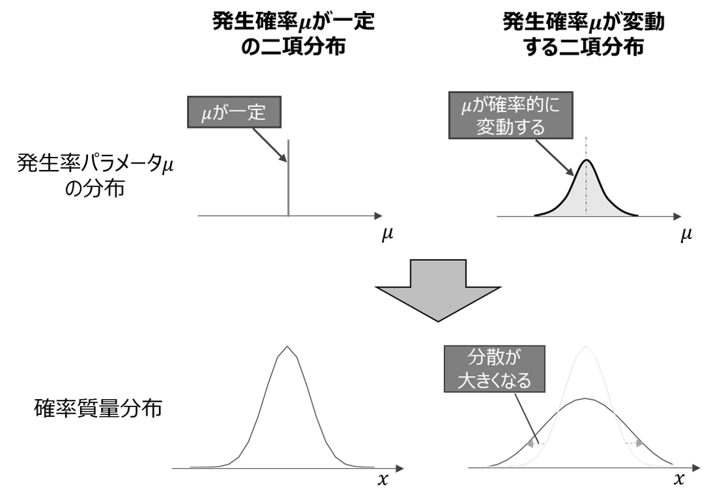
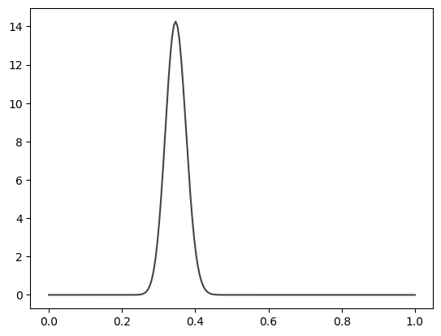
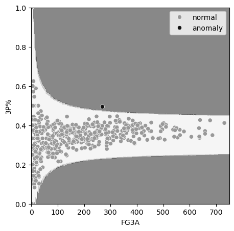
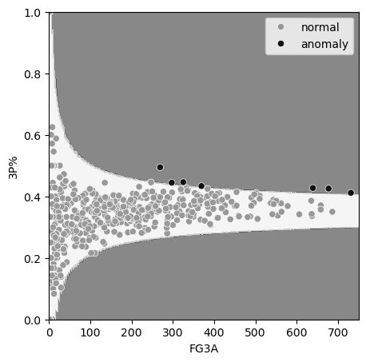

# 過分散のあるポアソン分布モデル（負の二項分布モデル）

工業製品のロットあたりの不良品数や時間あたりの故障発生数、野球の安打数のような**計数データ**（count data）をモデリングするには、対象とする現象に応じて以下のように二項分布・ポアソン分布を使い分けます。

|確率分布名|モデリング対象の現象|例|
|---|---|---|
|二項分布|$n$回試行した際の発生数$x$|ロットあたり不良品数、野球の安打数|
|ポアソン分布|面積・時間$t$あたりの発生数$x$|機械の時間あたり故障発生数、面積あたり雑草発生数|

このような**二項分布、ポアソン分布を用いた計数データのモデリング**は、現象の**発生確率**（二項分布では成功確率パラメータ$\mu$、ポアソン分布では単位区間あたり平均発生数パラメータ$\mu$）**が一定であることを前提**としています。
発生確率が一定でない場合、以下の図に示すようにデータのばらつきが二項分布・ポアソン分布が予測するよりも大きくなる、**過分散**（overdispersion）と呼ばれる現象が発生します。



過分散が発生している場合、二項分布・ポアソン分布をそのまま使用すると、データの挙動を精度よくモデリングすることができません。代わりに以下のようにベータ二項分布、負の二項分布を用いることで、過分散を考慮したモデリングを実現できます。

- 過分散を含む二項分布：**ベータ二項分布**
- 過分散を含むポアソン分布：**負の二項分布**

ここでは面積・時間$t$あたりの発生数$x$に過分散が発生しているケースに、負の二項分布による異常検知を適用する方法を解説します。

## 負の二項分布による過分散のモデリング

面積・時間$t$あたりの発生数$x$のモデリングには、過分散を考慮しない場合はポアソン分布を用います。過分散を考慮する場合は、ポアソン分布の代わりに**負の二項分布**（beta-binomial distribution）を用います。

### ポアソン分布における過分散発生の実例

ポアソン分布を用いたモデリングでの過分散の有無について、身近な例を使って考えてみましょう。

たとえばある地域での月当たり事故件数を記録するケースを考えます。同じ地域内であっても、走行する道路や気象条件などによって真の事故発生率（単位区間あたり発生率パラメータ$\mu$に相当）は均一ではないと考えるのが自然です。このように観測単位ごとに$\mu$が変動すると、ポアソン分布が仮定する「平均＝分散」という関係が崩れ、その結果として過分散が発生します。

また工場の生産ラインを例に挙げると、ガラスなどの板状製品の面積あたり欠陥発生数や、液体や粉体における体積あたり欠陥発生数も、欠陥発生率$\mu$は環境条件や設備状態などの影響を受けて変動するため、程度の差はあれ過分散が発生するケースが多いでしょう。

一方で、「面積あたり欠陥発生数が安定した工程での平均から変化したかを検知したい」のような、平均的な状態からの逸脱を検出することが目的の場合には、面積あたり欠陥発生数が一定であると仮定し、その仮定からの差異を検出するようモデルを構築します。このように、モデリングで過分散を考慮するかどうかは、実際に過分散が存在するかどうかだけでなく、分析の目的や前提とする仮説によっても決められるべきものです。

また、工場の生産ラインの例を見ても分かるように、よくコントロールされた生産工程では$\mu$がほぼ一定である場合もあれば、外的影響を受けやすい工程であれば$\mu$が大きく変動する場合もあります。したがって、ドメイン知識だけから過分散の有無を判断することは一般には困難です。そのため[後述するように]()、**過分散の有無はデータから統計的に判定することが望ましい**と言えるでしょう。

### 負の二項分布モデルの概要

負の二項分布モデルは、ポアソン分布の期待発生回数（観測区間$t$が変化する場合は単位区間あたり平均発生数）パラメータがガンマ分布に従うモデルです。過分散を引き起こす、発生確率の変化がガンマ分布に従うモデルとみなしてよいでしょう。

負の二項分布を定式化する場合、観測区間$t$が一定の場合とデータごとに異なる場合で、分けて考えると理解しやすいでしょう。

#### 観測区間$t$が一定の場合

観測区間$t$が一定の場合、負の二項分布モデルは、ポアソン分布の期待発生回数パラメータ$\mu$が形状母数$k$・尺度母数$\theta$のガンマ分布$Ga(\mu \mid k,\theta)$に従う、以下の式で表されるモデルとなります。$\mu$が一定ではなくガンマ分布に従って確率的に変動するため、過分散を表現することができます。

```math
\begin{aligned}
\mu &\sim Ga(k,\theta) \\
x &\sim Po(\mu)
\end{aligned}
\tag{8.201}
```

このとき、予測分布$p(x \mid k,\theta)$は、ポアソン分布モデルのパラメータ$\mu$の全てのとりうる値を考慮するために、その確率密度関数をかけて積分消去（周辺化）することで求められます。

```math
\begin{aligned}
p(x \mid k,\theta)
&=
\int_0^\infty Po(x \mid \mu) Ga(\mu \mid k,\theta) d\mu \\
&=
\frac{\Gamma(k+x)}{\Gamma(k) x!} \bigg(\frac{1}{1+\theta}\bigg)^k \bigg(\frac{\theta}{1+\theta}\bigg)^x \\
&=
NB\Big(x \mid k,\frac{1}{1+\theta}\Big)
\end{aligned}
\tag{8.202}
```

#### 観測区間$t$がデータごとに異なる場合

観測区間$t$がデータごとに異なる場合、負の二項分布モデルは、単位区間あたり平均発生数$\mu$がガンマ分布$Ga(\mu \mid k,\theta)$に従い、$\mu t$がポアソン分布の期待発生回数パラメータとなる、以下のモデルとなります。

```math
\begin{aligned}
\mu &\sim Ga(k,\theta) \\
x &\sim Po(\mu t)
\end{aligned}
\tag{8.203}
```

このとき、予測分布$p(x \mid t,k,\theta)$は、ポアソン分布モデルのパラメータ$\mu$の全てのとりうる値を考慮するために、その確率密度関数をかけて積分消去（周辺化）することで求められます。

```math
\begin{aligned}
p(x \mid t,k,\theta)
&=
\int_0^\infty Po(x \mid \mu t) Ga(\mu \mid k,\theta) d\mu \\
&=
\frac{\Gamma(k+x)}{\Gamma(k) x!} \bigg(\frac{1}{1+\theta t}\bigg)^k \bigg(\frac{\theta t}{1+\theta t}\bigg)^x \\
&=
NB\Big(x \mid k,\frac{1}{1+\theta t}\Big)
\end{aligned}
\tag{8.204}
```

観測区間$t$が一定の場合の式 (8.203)は、式 (8.204)に$t=1$を代入した場合と等しくなることが分かります。よって以降は観測区間$t$がデータごとに異なる場合を想定し、**観測区間**$t$**が一定の場合は**$t=1$**と読み替えて解釈してください**。

### 負の二項分布モデルの最尤推定

負の二項分布モデルの最尤推定では、ガンマ分布のパラメータ$k,\theta$が推定対象となります。

書籍中の対数尤度の式 (4.20)と予測分布の式 (8.204)から、負の二項分布モデルの対数尤度は以下のように表されます（観測区間$t$が一定の場合は$t=1$を代入）。

```math
\begin{aligned}
\log L(\boldsymbol{X} \mid \boldsymbol{t},k,\theta)
&=
\log \prod_{i=1}^N p(x^{(i)} \mid t^{(i)},k,\theta) \\
&=
\sum_{i=1}^N \log \bigg( \frac{\Gamma(k+x^{(i)})}{\Gamma(k) x^{(i)}!} \bigg(\frac{1}{1+\theta t^{(i)}}\bigg)^k \bigg(\frac{\theta t^{(i)}}{1+\theta t^{(i)}}\bigg)^{x^{(i)}} \bigg) \\
&=
\sum_{i=1}^N \bigg(\log \frac{\Gamma(k+x^{(i)})}{\Gamma(k) x^{(i)}!} + k\log \bigg(\frac{1}{1+\theta t^{(i)}}\bigg) + x^{(i)}\log \bigg(\frac{\theta t^{(i)}}{1+\theta t^{(i)}}\bigg) \bigg)
\end{aligned}
\tag{8.205}
```

この式の最大化は基本的には解析的に解けないため、各種**数値最適化**アルゴリズムを使用して対数尤度を最大化するように$k,\theta$の値を探索することが一般的です。

## 負の二項分布モデルによる異常検知の実施手順

　負の二項分布モデルの最尤推定による異常検知の手順を、学習と推論に分けて紹介します。

### 学習ステップ1. 正常のモデルを作成する

　正常のモデルとして、正常データ（学習データ）に対して当てはまりのよいベータ二項分布を求めます。具体的には、パラメータ$k,\theta$の最尤推定値$\hat{k},\hat{\theta}$を学習データを用いた数値最適化により求めます。

### 学習ステップ2. 異常を表す指標（異常度）を定義する

1章の定義に従うのであれば、最尤推定で求めたパラメータ$\hat{k},\hat{\theta}$と式(8.205)から求めた負の対数尤度（観測区間$t$が一定の場合は$t=1$を代入）

```math
\begin{aligned}
a(x,t)
&=
- \log p(x \mid t,\hat{k},\hat{\theta}) \\
&=
- \log NB(x \mid t,\hat{k},\hat{\theta}) \\
&=
- \log \bigg( \frac{\Gamma(\hat{k}+x)}{\Gamma(\hat{k}) x!} \bigg(\frac{1}{1+\hat{\theta} t}\bigg)^{\hat{k}} \bigg(\frac{\hat{\theta} t}{1+\hat{\theta} t}\bigg)^x \bigg) \\
&=
- \log \frac{\Gamma(\hat{k}+x)}{\Gamma(\hat{k}) x!} - \hat{k}\log \bigg(\frac{1}{1+\hat{\theta} t}\bigg) - x\log \bigg(\frac{\hat{\theta} t}{1+\hat{\theta} t}\bigg)
\end{aligned}
\tag{8.206}
```

　を異常度として用いたいところですが、通常のポアソン分布と同様に負の対数尤度をそのまま用いると$t$が変化した際に誤報率を一定に保てなくなるため、異常度$a(x,n)$は用いず、負の二項分布の累積分布関数に基づき$x$に直接しきい値を設ける方法をとります。
（$t$が一定の場合は式 (8.206)を異常度として用いてもOKです）

### 学習ステップ3. しきい値を設ける

　変数$x$に直接しきい値を設ける方法を考えます。正常データにおいて、この$x$はステップ1で求めた$\hat{k},\hat{\theta}$を式 (8.204)に代入して得られた負の二項分布

```math
NB(x \mid t,\hat{k},\hat{\theta})
\tag{8.207}
```

　に従います（観測区間$t$が一定の場合は$t=1$を代入）。よって負の二項分布の累積分布関数とターゲットとする誤報率に基づき、上下両方向にしきい値を設けると良いでしょう。

　例えばターゲットとする誤報率として$0.0027$を採用する場合、パラメータ$\hat{k},\hat{\theta}$、観測区間$t$の負の二項分布の累積分布関数の逆関数に$0.0027 \div 2 = 0.00135$を入力した値

```math
x_{thl}=NB_{CDF}^{-1} (0.00135 \mid t,\hat{k},\hat{\theta})
\tag{8.208}
```
　
　を下側しきい値として、

```math
x_{thh}=NB_{CDF}^{-1} (1-0.00135 \mid t,\hat{k},\hat{\theta})
\tag{8.209}
```
　
　を上側しきい値として用います。これらのしきい値は推論データの観測区間$t$を含むため、学習時点では求められません。よって推論時に都度求める必要があります。

### 推論手順
　
　推論時は、学習時に最尤推定で求めたパラメータ$\hat{k},\hat{\theta}$、および推論データの観測区間$t$を用いて、以下手順で異常の有無を判定します。

- 学習ステップ3で定義した式 (8.208)および式 (8.209)に基づき、上側しきい値と下側しきい値を求める
- 推論データ$x$が下側しきい値以下または上側しきい値以上であれば異常あり、そうでなければ異常なしと判定する

## 負の二項分布モデルによる異常検知の実装

　先ほどの学習手順、推論手順に基づいた異常検知を、Pythonで実装してみます。

今回はモデリングの対象として、書籍の5章でも使用したスリーポイントシュート成功率のデータ[^nba_stats]を使用します。

```csv
PLAYER_ID,AGE,FG3M,FG3A
203932,23.0,121,347
1628988,22.0,43,127
1627846,25.0,32,100
201143,33.0,73,203
202329,28.0,96,280
 :
```

`FG3A`列がスリーポイントシュートの試投数$n$を、`FG3M`列が成功数$x$を表しており、2022年度のデータを学習データ、2023年度のデータを推論データとして用います。

過分散を考慮しない二項分布モデルでは、「平均的な選手よりも偶然の範囲を超えて成功率が高い選手」の検出を目的としていましたが、過分散を考慮するベータ二項分布モデルでは、「**個人差を考慮した上で、偶然の範囲を超えて成功率が高い選手**」を検出することができます。

[^nba_stats]:https://www.nba.com/stats/players/traditional

### 学習

学習フェーズでは、最尤推定による確率分布パラメータの推定を実施します。

SciPyにはベータ二項分布を実装するためのクラス`scipy.stats.betabinom`が用意されていますが、残念ながら最尤推定を実行するための`fit`メソッドが準備されていません。よってまずは以下のように、SciPyの数値最適化用メソッド`scipy.optimize.minimize`関数を用いて、最尤推定を実行する関数を実装します。
　
: コード 8.102 | ベータ二項分布の最尤推定を実行する関数

```python
import numpy as np
from scipy.stats import betabinom
from scipy.optimize import minimize

def betabinom_neg_log_likelihood(params, x, n):
    """ベータ二項分布の負の対数尤度を計算する関数（数値最適化の目的関数）"""
    alpha, beta = params
    # パラメータa,bは正の値でなければならない
    if alpha <= 0 or beta <= 0:
        return np.inf
    # 確率質量関数の対数の和（データ全体の対数尤度）を計算
    log_pmf_sum = betabinom.logpmf(x, n, alpha, beta).sum()
    # 負の対数尤度を返す
    return -log_pmf_sum

def betabinom_mle(x, n, initial_params=(1.0, 1.0)):
    """ベータ二項分布の最尤推定を実行する関数"""
    result = minimize(
        betabinom_neg_log_likelihood,
        initial_params,
        args=(x, n),
        method='L-BFGS-B',  # 数値最適化のアルゴリズム（L-BFGS-B）
        bounds=[(1e-5, None), (1e-5, None)]  # パラメータalpha,betaは正の値
    )
    if result.success:
        return result.x  # 最適化されたパラメータalpha,betaを返す
    else:
        raise RuntimeError("最尤推定が収束しませんでした。")
```

この関数を用いて、2022年度のデータを読み込んで最尤推定を実施します。
　
: コード 8.103 | ベータ二項分布の最尤推定による異常検知の実装例（学習）

```python
import pandas as pd

###### 学習データの読込と前処理 ######
# スリーポイントシュート成功率データ
df_train = pd.read_csv('./../datasets/player_stats_2022.csv')
df_train = df_train[df_train['FG3A'] > 0] # 試投数0を除外
# 学習データの成功数x、試行数nを別々に保持してndarray化
x_train = df_train['FG3M'].to_numpy()
n_train = df_train['FG3A'].to_numpy()

###### 学習ステップ1. 正常のモデルを作成する ######
# ベータ二項分布の最尤推定を実行
alpha, beta = betabinom_mle(x_train, n_train)

###### 学習ステップ2. 異常を表す指標（異常度）を定義する ######
# 式を定義するのみでプログラム上は処理を実施しない

###### 学習ステップ3. 異常度にしきい値を設ける ######
# 推論時に都度算出するので、学習時はしきい値を求めない

###### 学習で求めたパラメータを表示 ######
print(f"alpha={alpha}, beta={beta}")
```

　実行結果

```console
alpha=100.56908050114423, beta=188.942229218715
```

　推定したパラメータ$\hat{\alpha},\hat{\beta}$に基づき、成功確率パラメータ$\mu$が従うベータ分布の確率密度関数を可視化すると、以下のようになります。


　
　$\mu$がある程度広がりをもった分布に従っていることが分かります。この広がりが過分散であり、今回のケースでは（真の）スリーポイントシュート成功率の個人差に相当します。このような過分散を考慮したモデルを使用して異常検知を実施することで、二項分布のばらつきだけでなく、個人の能力のばらつきの範囲を超えて成功率が高い選手を検出することができます。

### 推論

　学習フェーズで推定したパラメータ$\hat{\alpha},\hat{\beta}$と推論データの試投数$n$を用いて、式 (8.107)および式 (8.108)から上下のしきい値を求め、推論データのシュート成功数$x$に対して異常判定を行います。
　
: コード 8.104 | ベータ二項分布の最尤推定による異常検知の実装例（推論）

```python
from scipy import stats

###### 学習したパラメータをここに記載
ALPHA = alpha  # パラメータalpha
BETA = beta    # パラメータbeta

###### 推論データの読み込みと前処理######
# 2023年度のスリーポイントシュート成功率データを推論データとする
df_inference = pd.read_csv("./../datasets/player_stats_2023.csv")
# 試投数5以下を除外（表示の都合上）
df_inference = df_inference[df_inference["FG3A"] > 0]
n_inference = df_inference["FG3A"].to_numpy() # 推論対象の試投数n
x_inference = df_inference["FG3M"].to_numpy() # 推論対象の成功数x

###### 推論を実行######
TARGET_FP_RATE = 0.0027 # ターゲットとする誤報率（正規分布の3σ相当=0.0027）
# 下側しきい値（ベータ二項分布の累積分布関数から計算）
th_lowers = stats.betabinom.ppf(TARGET_FP_RATE/2, n=n_inference, a=ALPHA, b=BETA)
# 上側しきい値（ベータ二項分布の累積分布関数から計算）
th_uppers = stats.betabinom.ppf(1 - TARGET_FP_RATE/2, n=n_inference, a=ALPHA, b=BETA)
# しきい値により異常の有無を判定
pred = np.where((x_inference < th_lowers) | (x_inference > th_uppers),
                "anomaly", "normal")
# 推論結果を表示（しきい値を超えた選手）
df_inference["3P%"] = x_inference / n_inference # 成功率
df_inference["prediction"] = pred
print(df_inference[df_inference["prediction"] == "anomaly"][
      ["PLAYER_ID", "3P%", "FG3A", "FG3M"]].sort_values(
      "3P%", ascending=False).reset_index(drop=True))
```

判定のしきい値を超えた選手の一覧をリストアップします。

```console
   PLAYER_ID       3P%  FG3A  FG3M
0    1628379  0.494424   269   133
```

検出された`PLAYER_ID`が1628379の選手は、2022年シーズンの選手のばらつきから推測される偶然の範囲を超えて（発生率0.0027以下）、スリーポイントシュート成功率が高いと言えるでしょう。

　推論の結果、異常と判定される範囲を推論データと重ねて可視化します。横軸`FG3A`は試投数$n$、縦軸`3P%`は成功率$\frac{x}{n}$ を表します。背景の塗りつぶし色が明るい部分が正常判定、暗い部分が異常判定される範囲を表します。重ねてプロットしている散布図が推論データを、異常判定された選手を黒点で示しています。


　
　比較対象として、過分散を考慮しない二項分布モデルでの異常判定の範囲（書籍中の図5.5）を以下に示します。



二項分布モデルと比べ、過分散を考慮したベータ二項分布モデルは、ベータ分布由来のばらつき（過分散）が加わって予測分布の分散が⼤きくなり、正常判定の範囲が広がったことがわかります。

## 過分散の有無をデータから判定する方法

ポアソン分布モデルの過分散の判定には、以下の2種類の方法がよく用いられます

- **ピアソンのカイ二乗統計量と自由度の比率**（[二項分布の過分散判定]()と同様）
- **Cameron and Trivedi’s test**[^cameron_trivedi]

それぞれ解説します。

[^cameron_trivedi]:https://www.sciencedirect.com/science/article/abs/pii/030440769090014K

### ピアソンのカイ二乗統計量を用いた過分散の判定

[二項分布の過分散判定]()でも解説したように、ピアソンのカイ二乗統計量$X^2$は以下の式で定義されます。

```math
\begin{align}
X^2 = \sum_{i=1}^N \frac{(x^{(i)} - \hat{\mu}^{(i)})^2}{V[\hat{\mu}^{(i)}]}
\end{align}
\tag{8.210}
```

分子の$x^{(i)}$は変数$x$の実測値、$\hat{\mu}^{(i)}$はモデルが予測した変数$x$の理論上の平均を表し、ポアソン分布の場合は$\hat{\mu}^{(i)}=\hat{\mu} t^{(i)}=t^{(i)}\frac{\sum_{i=1}^N x^{(i)}}{\sum_{i=1}^N t^{(i)}}$となります。

分母の$V[\hat{\mu}^{(i)}]$は、変数$x$が従う確率分布の理論上の分散で、ポアソン分布の分散は期待発生回数パラメータと等しくなることから、$\hat{\mu} t^{(i)}$となります。

以上まとめるとポアソン分布の$X^2$は以下の式で表されます。

```math
\begin{align}
X^2 = \sum_{i=1}^N \frac{(x^{(i)} - \hat{\mu} t^{(i)})^2}{\hat{\mu} t^{(i)}}
\end{align}
\tag{8.211}
```

過分散がなければ、このピアソンのカイ二乗統計量$X^2$と、モデルの自由度$N-1$（データ数$N-$パラメータの個数$1$）の比率

```math
\begin{align}
\hat{D} = \frac{X^2}{N-1}
\end{align}
\tag{8.212}
```

は、1になります。よってこの$\hat{D}$が1より一定以上大きければ、過分散ありとみなして良いでしょう。

過分散ありとみなす$\hat{D}$のしきい値には決まった値があるわけではないですが、経験的には1.5や2.0という値がよく用いられています（[例](https://sites.google.com/view/ynomura/stats/overdispersion)）。

#### ピアソンのカイ二乗統計量による過分散判定のPython実装

ピアソンのカイ二乗統計量$X^2$を用いた過分散判定を、Pythonで実装する方法を解説します。
　
: コード 8.101 | 二項分布モデルの過分散の判定

```python
import pandas as pd
import numpy as np

###### 学習データの読込と前処理 ######
# スリーポイントシュート成功率データ
df_train = pd.read_csv('./../datasets/player_stats_2022.csv')
df_train = df_train[df_train['FG3A'] > 0] # 試投数0を除外
# 学習データの成功数x、試行数nを別々に保持してndarray化
x_train = df_train['FG3M'].to_numpy()
n_train = df_train['FG3A'].to_numpy()

###### ピアソンのカイ二乗統計量を用いて過分散の有無を判定 ######
mu = np.sum(x_train) / np.sum(n_train)  # 発生率パラメータμの最尤推定量
chi2 = np.sum((x_train - n_train * mu) ** 2 / (n_train * mu * (1 - mu)))  # ピアソンのカイ二乗統計量
df = len(x_train) - 1  # 自由度
overdispersion_ratio = chi2 / df  # 過分散比D
print(f'ピアソンのカイ二乗統計量: {chi2:.2f}')
print(f'自由度: {df}')。
print(f'過分散比 D: {overdispersion_ratio:.2f}')
```

### Cameron and Trivedi’s testによる過分散の判定

まず過分散が発生しておらず、確率変数$X_i$がポアソン分布に従うケースを考えます（ここではポアソン回帰のように確率分布パラメータが動的に変化するケースも考慮するため、$X$ではなく$X_i$という表記を用います）。
ポアソン分布は、期待値と分散が共に期待発生回数パラメータと等しくなるという性質を持ちます。この性質は、単位区間あたり平均発生数を$\mu_i$とすると、期待発生回数パラメータは$\mu_i t_i$（以降、$\mu_i t_i=\lambda_i$とおきます）となるので、以下の式で表されます。

```math
\begin{align}
\mathbb{E}[X_i]&=\lambda_i \\
V[X_i]&=\lambda_i
\end{align}
\tag{8.213}
```

一方で、過分散が発生していて$X$が負の二項分布に従う場合、期待値と分散は以下の式で表されます。（この式で表される理由は[後述]()します）

```math
\begin{align}
\mathbb{E}[X_i]&=\lambda_i \\
V[X_i]&=\lambda_i+\alpha\lambda_i^2
\end{align}
\tag{8.214}
```

この分散はちょうど、過分散がない場合の分散に$\alpha\lambda_i^2$が加わったものとなります。

Cameron and Trivedi’s testはこの関係を利用し、

```math
\begin{align}
V[X_i]&=\lambda_i+\alpha\lambda_i^2
\end{align}
\tag{8.215}
```

とおいたとき、$\alpha=0$（$X_i$がポアソン分布に従う）という帰無仮説

```math
\begin{align}
H_0:\alpha = 0 \quad (\text{過分散なし}) \\
H_1:\alpha > 0 \quad (\text{過分散あり})
\end{align}
\tag{8.216}
```

を検定する手法です。帰無仮説が棄却されれば過分散ありと判定されます。

式 (8.215)は以下のように変形できます。

```math
\begin{align}
\alpha\lambda_i^2&=V[X_i]-\lambda_i \\
&=\mathbb{E}[(X_i-\mathbb{E}[X_i])^2]-\lambda_i \\
&=\mathbb{E}[(X_i-\lambda_i)^2]-\lambda_i \\
&=\mathbb{E}[(X_i-\lambda_i)^2-\lambda_i]
\end{align}
\tag{8.216}
```

両辺を$\lambda_i$で割って左右を入れ替えると

```math
\begin{align}
\mathbb{E}\bigg[\frac{(X_i-\lambda_i)^2-\lambda_i}{\lambda_i}\bigg]&=\alpha\lambda_i
\end{align}
\tag{8.217}
```

これは$X'_i=\frac{(X_i-\lambda_i)^2-\lambda_i}{\lambda_i}$の期待値が$\alpha\lambda_i$に比例することを表しており、$X'_i$を目的変数、$\lambda_i$を説明変数とした線形回帰（切片なし）で表されることを意味します。

Cameron and Trivedi’s testでは、この線形回帰の傾き係数$\alpha$のp値を検定で用います。切片=0という制約は付きますが、基本的には通常の線形回帰と同様の原理でp値を求めます。

線形回帰を行うためには、未知量である$\lambda_i$を計算できる値で置き換える必要があります。具体的には、1箇所のみ$\mathbb{E}[X_i]=\lambda_i$という関係を活かして$x^{(i)}$で置き換え、それ以外は最尤推定量$\hat{\lambda}^{(i)}$で置き換えた以下の式を用います。

```math
\begin{align}
\frac{(x^{(i)}-\hat{\lambda}^{(i)})^2-x^{(i)}}{\hat{\lambda}^{(i)}}&=\alpha\hat{\lambda}^{(i)}
\end{align}
\tag{8.218}
```

1箇所のみ$x^{(i)}$で置き換えている理由は、$\mathbb{E}[X_i]=\lambda_i$が厳密に成り立つのに対し、$\mathbb{E}[\hat{\lambda}^{(i)}]$は推定誤差や$X_i$への依存性の影響で$\lambda_i$と厳密に一致しないため、より誤差の少ない前者を採用しているようです。

また、回帰的要素を持たない（GLMではない）今回のポアソン分布モデルでは、単位区間あたり平均発生数パラメータの最尤推定値$\hat{\mu}=\frac{\sum_{i=1}^N x^{(i)}}{\sum_{i=1}^N t^{(i)}}$が常に同じ値となるため、$\hat{\lambda}^{(i)}=t^{(i)}\hat{\mu}$と計算できます。

式 (8.218)に対し、$x'^{(i)}=\frac{(x^{(i)}-\hat{\lambda}^{(i)})^2-x^{(i)}}{\hat{\lambda}^{(i)}}$を各データの目的変数、$\hat{\lambda}^{(i)}$を説明変数として切片=0の制約条件をつけた線形回帰を行い、得られた傾き$\alpha$の推定量を$\hat{\alpha}$とします。このとき、線形回帰の係数の検定に用いる統計量$z$は、以下の式で表されます（ここでは。[参考](https://datawokagaku.com/lin_reg_coef/)）。$\hat{\alpha}$や$\mathrm{SE}(\hat{\alpha})$の具体的な計算方法は線形回帰のアルゴリズムや等分散仮定の有無によって変わるため、ここでは割愛します）

```math
\begin{align}
z=\frac{\hat{\alpha}}{\mathrm{SE}(\hat{\alpha})}
\end{align}
\tag{8.219}
```

1変数線形回帰においてこの$z$は自由度$N-2$の$t$分布に従うので、その累積分布関数からp値を求めます。サンプルサイズがある程度多い場合、近似計算手法として$z$が標準正規分布に従うとみなし、その累積分布関数からp値を求めることもできます。

このp値が有意水準以下であれば過分散ありと判定できます。このケースでは、$\mu$の変動を考慮してモデリングしたいのであれば、負の二項分布モデルを用いると良いでしょう。p値が有意水準より大きい場合、厳密な仮説検定の観点では「過分散なし」と判定することはできませんが、慣例上は過分散なしとみなしてポアソン分布モデルを用いることが一般的です。

#### Cameron and Trivedi’s testのPython実装

## 参考：負の二項分布モデルとポアソン分布のベイズ推定

実は負の二項分布は、単位区間あたり平均発生数$\mu$の事前分布をベータ分布として、ポアソン分布をベイズ推定した場合の予測分布でもあります。

負の二項分布モデルのガウス分布は、単位区間あたり平均発生数$\mu$の変動により過分散を明示的に表現することを目的として、モデルに導入されていました。一方でベイズ推定の事前分布は、単位区間あたり平均発生数$\mu$の事前知識のあいまいさを表現することを目的としており、過分散を明示的に表現しているわけではありません。すなわちこの2種類のモデルは、予測分布の確率分布の種類は同じだが、ガンマ分布の導入目的が異なると言えるでしょう。

ポアソン分布のベイズ推定を具体的に見ていきます。ポアソン分布

```math
\begin{aligned}
x &\sim Po(\mu t)
\end{aligned}
\tag{8.114}
```

において、発生率パラメータ$\mu$の共役事前分布としてガンマ分布$Ga(\mu \mid \theta_0,k_0)$を採用したときの予測分布を求めてみます（詳細な計算式は[こちら]()参照）。

　$\mu$の事前分布が共役事前分布であることから、事後分布もガンマ分布となり、以下のように求まります。

```math
p(\mu \mid \boldsymbol{X})=Ga\Bigl(\mu \mathrel{} \Bigl| k_0+\sum_{i=1}^N x^{(i)}, \mathrel{} \frac{\theta_0}{1+\theta_0\sum_{i=1}^N t^{(i)}}\Bigr)
\tag{5.70}
```

　$k_N=k_0+\sum_{i=1}^N x^{(i)}$、$\theta_N=\frac{\theta_0}{1+\theta_0\sum_{i=1}^N t^{(i)}}$、とおくと、予測分布は以下の負の二項分布として求まります。

```math
\begin{aligned}
p(x \mid t,\boldsymbol{X})
&=
NB \Bigl(x \mathrel{} \Bigl| \mathrel{} k_N, \frac{1}{1 + k_Nt}\Bigr) \\
&=
\binom{x+k_N-1}{k_N-1} \Bigl(\frac{1}{1 + \theta_N t}\Bigr)^{k_N} \Bigl(1-\frac{1}{1 + \theta_N t}\Bigr)^x
\end{aligned}
\tag{5.75}
```

　この予測分布は式(8.202)と同様に負の二項分布となっています。

この予測分布（負の二項分布）の分散は、以下の式で表されます。

```math
\begin{aligned}
\mathrm{Var}[p(x \mid t,\boldsymbol{X})]
&=
t k_N \theta_N + t^2 k_N \theta_N^2
\end{aligned}
\tag{5.75}
```

第1項の$t k_N \theta_N$はポアソン分布の分散を表しており、第2項の$t^2 k_N \theta_N^2$がそこからの分散増加分となります。
$k_N=k_0+\sum_{i=1}^N x^{(i)}$はサンプルサイズ$N$に比例したオーダーで大きくなり、$\theta_N=\frac{\theta_0}{1+\theta_0\sum_{i=1}^N t^{(i)}}$はサンプルサイズ$N$に反比例するため、第2項の全体としてはデータが増えるごとに$O(\frac{1}{N})$で小さくなっていきます。このことから、ベイズ推定の特徴であるデータ不足による推定のあいまいさ（分散）の、データが増えるごとの縮小が式からも確認できました。

　このようにポアソン分布のベイズ推定では、データが増えると予測分布が通常のポアソン分布に収束していくため、データの多寡とは無関係に発生している過分散を表現することはできないので、ご注意ください。

https://publicjournal.hatenablog.com/entry/2019/12/22/193805

https://people.stat.sc.edu/hitchcock/slides535day5spr2014.pdf

https://stackoverflow.com/questions/77434897/using-poisson-gamma-distribution-in-python
