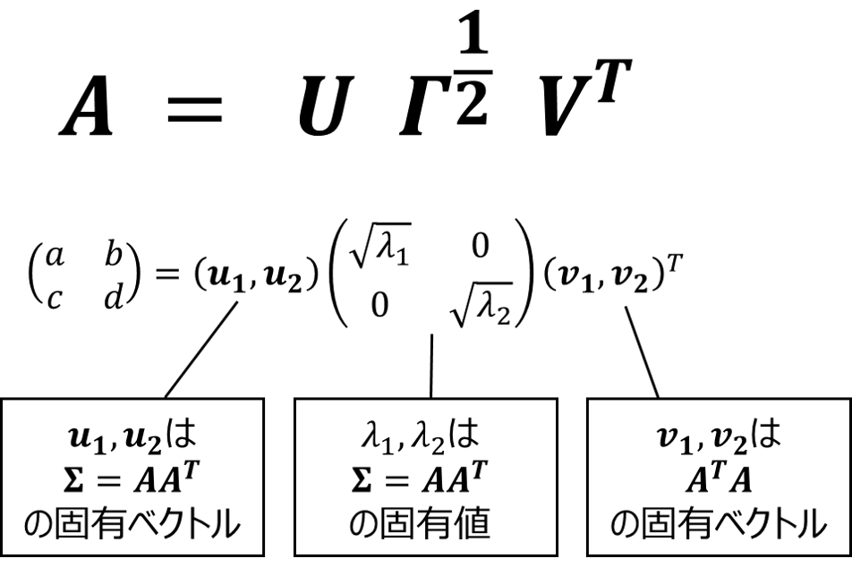
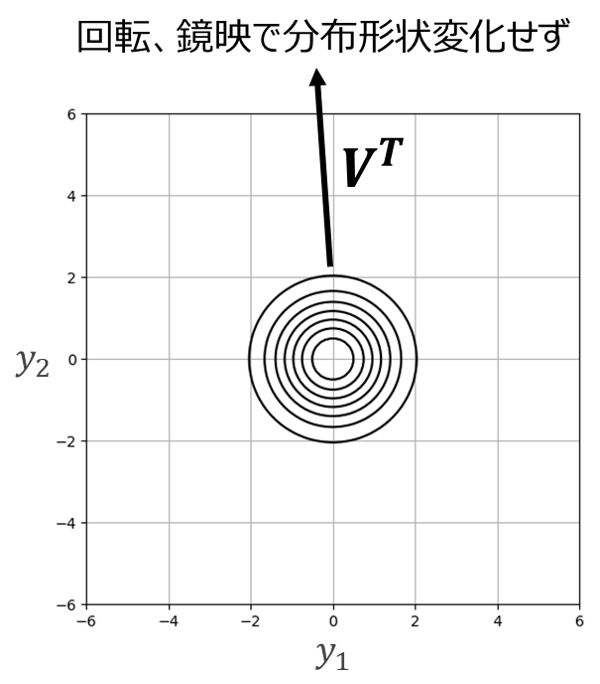
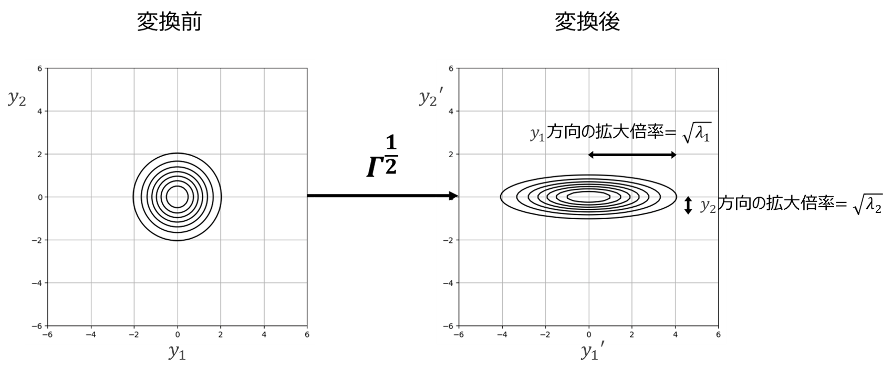
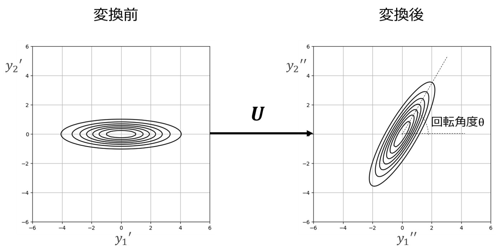
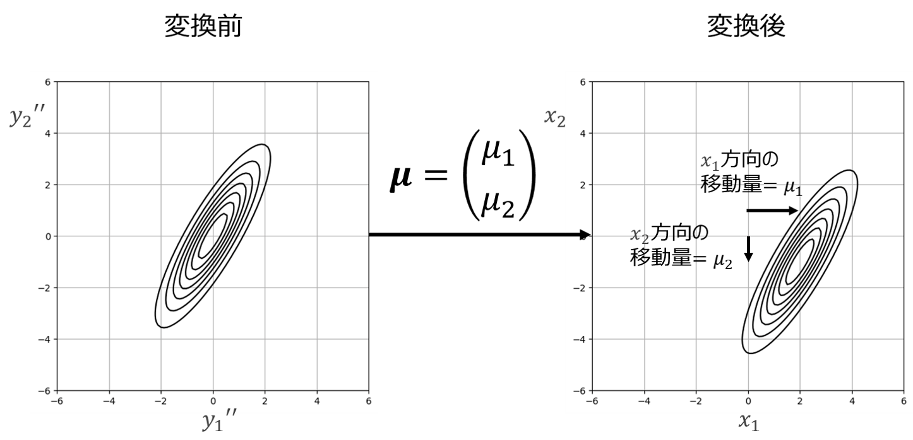
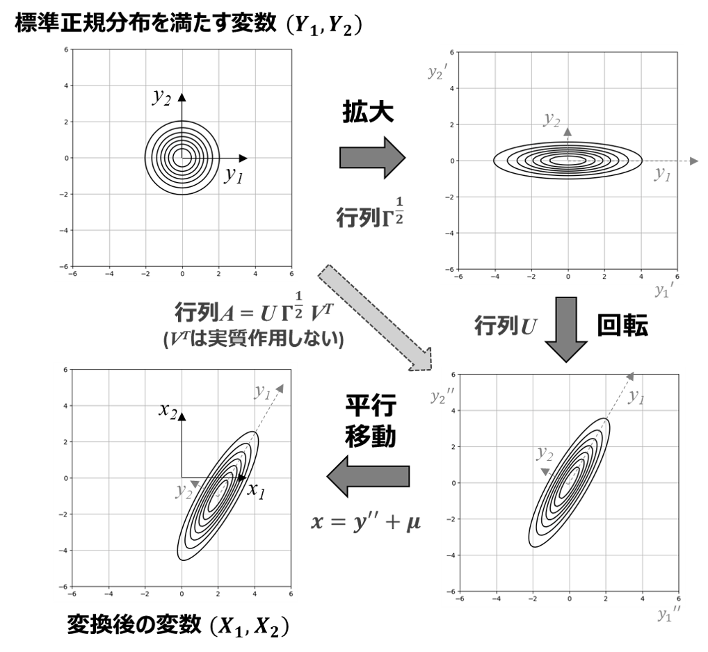

# 6章付録1 多次元正規分布の幾何的な意味

　式 (6.35)で示した多次元正規分布の同時確率密度関数の式

$\boldsymbol{\Sigma}: 分散共分散行列$

$\boldsymbol{\mu}: 平均ベクトル$
　
　の幾何的な意味を理解するために、以下の性質を満たすことを示していきます。

A. 多次元正規分布は、標準正規分布をアフィン変換することで得られる。
B. 線形変換を行う行列は、分散共分散行列、すなわち分散と共分散で表される。
C. 標準正規分布からのアフィン変換は、幾何的には拡大縮小・回転・平行移動の組み合わせに相当する。
　

## A. 多次元正規分布は、標準正規分布をアフィン変換することで得られる

　式 (6.36)で示した多変数の標準正規分布（変換前であることを表すため、確率変数の表記を$\boldsymbol{x}$から$\boldsymbol{y}$に変えています）

　を行列$\boldsymbol{A}$と平均ベクトル$\boldsymbol{\mu}$でアフィン変換

　すると、式 (6.35)の一般の多次元正規分布の同時確率密度関数が得られることを示します。
　
　まずは分かりやすいよう、2次元の場合を考えます。
　アフィン変換前の2変数を$Y_1,Y_2$、変換後の変数を$X_1,X_2$と表し、線形変換の行列$\boldsymbol{A}$を

　と表します。
　
　式 (6.38)を変形すると、

　となります。これを式 (6.36)に代入すると、

　実正方行列の転置と内積の関係$(\boldsymbol{A}\boldsymbol{v})^T\boldsymbol{w} = \boldsymbol{v}^T (\boldsymbol{A}^T\boldsymbol{w})$を適用して

正則行列の転置と逆行列の関係$(\boldsymbol{A}^{-1})^T = (\boldsymbol{A}^T)^{-1}$を適用して

正則行列の逆行列同士の積の関係$\boldsymbol{A}^{-1}\boldsymbol{B}^{-1} = (\boldsymbol{B}\boldsymbol{A})^{-1}$を適用して

　上記で変数変換による同時確率密度関数の変化は表現できましたが、変数変換により軸が伸び縮みした結果、全体での積分が1でなくなり確率の規格化条件を満たさなくなってしまいます。
　よって規格化条件を満たすよう、定数を新たに掛け直す必要があります。
　詳細は[東京大学出版会 1991]等を参照頂きたいですが、規格化条件を満たすために、変換後の確率密度関数にはヤコビ行列式$|\partial \boldsymbol{x} / \partial \boldsymbol{y}|$を掛ける必要があります。

式 (6.38)と式 (6.101)より、ヤコビ行列は

　と表されるため、ヤコビ行列の行列式$|\boldsymbol{A}|$を式 (6.106)に掛けた

　
　が、線形変換後の同時確率密度関数となります。

　なお、ここまで使用した行列の公式は全て$3 \times 3$以上の行列でも成立するため、3変数以上であっても標準正規分布を線形変換して式 (6.108)を得ることができます。
　
　天下り的ですが、$\boldsymbol{\Sigma}=\boldsymbol{A}\boldsymbol{A}^T$とおくと、式 (6.108)は

　書き換えることができ、多次元正規分布の同時確率分布関数の式 (6.35)に$M=2$を代入したものと同じになる事が分かりました。
　
　これで、冒頭の「A. 多次元正規分布の式は、標準正規分布を線形変換することで得られる」ことが示されました。

## B. 線形変換の行列は、分散共分散行列、すなわち分散と共分散で表される

　先ほど天下り的においた$\boldsymbol{\Sigma}=\boldsymbol{A}\boldsymbol{A}^T$が、分散共分散行列と等しいことを示します。

### 2次元の場合

　先ほどと同様に、まずは2次元の場合を考えてみます。
　
　まずは$\boldsymbol{\Sigma}$の具体的な成分を求めると、

　この各成分が分散共分散行列

　と等しくなることを、式 (6.101)から得られる

　という関係と、同時確率分布が標準正規分布である$Y_1$と$Y_2$は独立であることをふまえて示します。
　各成分ごとに順を追って計算を進めます。

##### $X_1$の分散$V[X_1]$

　まず$X_1$の分散$V[X_1]$が$a^2+b^2$と等しくなることを示します。式 (6.112)より、

　$Y_1$と$Y_2$は独立であることから、和の分散の公式$V[X_1+X_2]=V[X_1]+V[X_2]$と定数倍の分散の公式$V[cX]=c^2V[X]$より

　$Y_1,Y_2$は標準正規分布に従うので、その分散$V[Y_1],V[Y_2]$はいずれも1となり、

　となり、等しいことが示されました（$\boldsymbol{\Sigma}=\boldsymbol{A}\boldsymbol{A}^T$の左上の成分が一致）。

##### $X_2$の分散$V[X_2]$

　$X_2$の分散$V[X_2]$が$c^2+d^2$と等しくなることを示します。式 (6.112)より、$X_1$の分散の計算と同様に考えて

となり、等しいことが示されました（$\boldsymbol{\Sigma}=\boldsymbol{A}\boldsymbol{A}^T$の右下の成分が一致）。

##### $X_1$と$X_2$の共分散$\mathrm{Cov}[X_1,X_2]$

　$X_1$と$X_2$の共分散$\mathrm{Cov}[X_1,X_2]$が$ac+bd$と等しくなることを示します。

　共分散の計算公式$\mathrm{Cov}[X_1,X_2] = \mathbb{E}[X_1X_2]-\mathbb{E}[X_1]\mathbb{E}[X_2]$に式 (6.112)を代入すると、

　$Y_1,Y_2$は標準正規分布に従うので、その期待値$\mathbb{E}[Y_1],\mathbb{E}[Y_2]$はいずれも0となるため、最後の項を消去して

$Y_1$と$Y_2$は独立なので、$\mathbb{E}[Y_1Y_2]=\mathbb{E}[Y_1]\mathbb{E}[Y_2]=0$が成り立つので、

書籍の式 (6.21)より、$\mathbb{E}[f(X)^2]=V[f(X)]+\mathbb{E}[f(X)]^2$が成り立つので、$\mathbb{E}[Y_1^2]=V[Y_1]+\mathbb{E}[Y_1]^2=1+0^2=1, \quad \mathbb{E}[Y_2^2]=V[Y_2]+\mathbb{E}[Y_2]^2=1+0^2=1$より

　となり、等しいことが示されました（$\boldsymbol{\Sigma}=\boldsymbol{A}\boldsymbol{A}^T$の非対角成分が一致）。
　
　これで、$\boldsymbol{\Sigma}=\boldsymbol{A}\boldsymbol{A}^T$と分散共分散行列の全成分が一致している事が分かりました。
　よって2変数において、「B. 線形変換の行列は、分散共分散行列、すなわち分散と共分散で表される」ことが示されました。3変数以上の場合についての解説は本書では割愛しますが、2変数の計算と同様に対角成分と非対角成分に分けて考えると、2以上の任意の$M$変数において$\boldsymbol{\Sigma}=\boldsymbol{A}\boldsymbol{A}^T$は分散共分散行列と一致します。

### $M$次元の場合

一般の$M$次元正規分布に従う確率変数を$X_1,\cdots,X_M$、$M$次元標準正規分布に従う確率変数を$Y_1,\cdots,Y_M$、変換行列$\boldsymbol{A}$の各成分を$\boldsymbol{A}=(a_{ij}) \in \mathbb{R}^{M\times M}$とすると、以下のように表せます。

また、$\boldsymbol{A}\boldsymbol{A}^T$の各成分は$(\boldsymbol{A}\boldsymbol{A}^T)_{ij}=\sum_{k=1}^{M} a_{ik} a_{jk}$と表せます。

よって、これを分散共分散行列$\boldsymbol{\Sigma}$と比較して、

- 対角成分$(\boldsymbol{A}\boldsymbol{A}^T)_{ii}=\sum_{k=1}^{M} a_{ik}^2$が$V[X_i]$と等しいこと
- 非対角成分$(\boldsymbol{A}\boldsymbol{A}^T)_{ij}=\sum_{k=1}^{M} a_{ik} a_{jk}$が$\mathrm{Cov}[X_i,X_j]$と等しいこと

をそれぞれ示します。

##### 対角成分$(\boldsymbol{A}\boldsymbol{A}^T)_{ii}$が分散$V[X_i]$と等しいこと

式 (6.121)と、独立変数$Y_k$の和の分散の公式より、

$Y_1,\cdots,Y_M$は標準正規分布に従うので、その分散$V[Y_1],\cdots,V[Y_M]$はいずれも1となるので、

$=a_{i1}^2 + \cdots + a_{iM}^2 = \sum_{k=1}^{M} a_{ik}^2 = (\boldsymbol{A}\boldsymbol{A}^T)_{ii}$

　となり、等しいことが示されました。

##### 非対角成分$(\boldsymbol{A}\boldsymbol{A}^T)_{ij}$が共分散$\mathrm{Cov}[X_i,X_j]$と等しいこと

　共分散の計算公式$\mathrm{Cov}[X_i,X_j] = \mathbb{E}[X_iX_j]-\mathbb{E}[X_i]\mathbb{E}[X_j]$に式 (6.121)を代入すると、

$Y_i,Y_j$は標準正規分布に従うので、その期待値$\mathbb{E}[Y_i],\mathbb{E}[Y_j]$はいずれも0となるため、第二項は全て削除できます。また$Y_i$と$Y_j$は独立なので、$\mathbb{E}[Y_iY_j]=\mathbb{E}[Y_i]\mathbb{E}[Y_j]=0$が成り立ち、第一項は$k=l$のケースを除き削除できます。よって

$\mathbb{E}[f(X)^2]=V[f(X)]+\mathbb{E}[f(X)]^2$から、$\mathbb{E}[Y_k^2]=V[Y_k]+\mathbb{E}[Y_k]^2=1+0^2=1$より

　となり、等しいことが示されました。

## C. 標準正規分布からのアフィン変換は、幾何的には拡大縮小・回転・平行移動の組み合わせに相当する。

　ここまでの議論で、標準正規分布を$\boldsymbol{\Sigma}=\boldsymbol{A}\boldsymbol{A}^T$を満たす行列$\boldsymbol{A}$と平均ベクトル$\boldsymbol{\mu}$を用いてアフィン変換することで、多次元正規分布が得られることが分かりました。
　
　一方で、式だけではイメージが掴みにくいため、より理解を深めるためにこのアフィン変換の幾何的な意味を考えてみます。

### 特異値分解（SVD）

　線形変換の幾何的な意味を考える際、行列$\boldsymbol{A}$を分解して簡単な変換の組み合わせに分解すると、より筋道立てて図形的な解釈を引き出すことができます。このような行列の分解の代表的な手法の一つが、**SVD**（singular value decomposition：特異値分解）です。

　特異値分解を用いると、ランク$r$の任意の$M \times N$行列$\boldsymbol{A}$は以下のように分解されます。

$\boldsymbol{A} = \boldsymbol{U}\boldsymbol{\Gamma}^{\frac{1}{2}}\boldsymbol{V}^T$

$\boldsymbol{U}: \boldsymbol{A}\boldsymbol{A}^Tの正規化固有ベクトルを列ベクトルとして並べた行列 (直交行列)$

$\boldsymbol{\Gamma}: \boldsymbol{A}\boldsymbol{A}^Tの固有値を並べた対角行列$

$\boldsymbol{V}: \boldsymbol{A}^T\boldsymbol{A}の正規化固有ベクトルを列ベクトルとして並べた行列 (直交行列)$

　特に今回のように$\boldsymbol{A}$が正方行列かつ正則な場合、$\boldsymbol{\Gamma}^{\frac{1}{2}}$は$\boldsymbol{\Sigma}=\boldsymbol{A}\boldsymbol{A}^T$の固有値の平方根を並べた対角行列となり、特異値分解は以下の図のように表されます。

　
　特異値分解により得られるメリットとして、分解された3個の行列$\boldsymbol{U},\boldsymbol{\Gamma}^{\frac{1}{2}},\boldsymbol{V}^T$すべてがシンプルな幾何的変換で説明できることです。その意味を具体的に見ていきましょう。
　
　アフィン変換の式 (6.38)に特異値分解を適用すると、以下の式のように表されます。

　このとき、標準正規分布に従う変数（の実現値）$\boldsymbol{y}$から一般的な多次元正規分布に従う変数$\boldsymbol{x}$までの変数変換は、以下のように分解されます

1. $\boldsymbol{V}^T$による変換　→　作用しない（回転＋鏡映変換だが対称性により変化せず）
2. $\boldsymbol{\Gamma}^{\frac{1}{2}}$による変換　→ 拡大・縮小
3. $\boldsymbol{U}$による変換　→ 回転
4. $\boldsymbol{\mu}$による変換　→ 平行移動

1〜4それぞれの変換の幾何的意味を理解すれば、全体の変換が意味することを順を追って理解することができます。
　各々の変換の意味を考えてみます。

##### 1. $\boldsymbol{V}^T$による変換（直交変換）
　
　$\boldsymbol{V}$は直交行列であることから、その転置（逆行列）である$\boldsymbol{V}^T$も直交行列となります。
　2次元の直交行列を掛ける操作（直交変換）は、

- 原点中心の回転（回転）
- 原点を通る直線に対する線対称変換（鏡映）

のいずれかで表されます。本ケースでは変換対象となる$\boldsymbol{y}$が点対象かつ線対象な標準正規分布であることから、以下の図に示すように回転、鏡映ともに分布形状が変化しないことが分かります。

##### 2. $\boldsymbol{\Gamma}^{\frac{1}{2}}$による変換（拡大縮小）

　$\boldsymbol{\Gamma}^{\frac{1}{2}}$は対角行列となり、1個目の対角成分は$\sqrt{\lambda_1}$、2個目の対角成分は$\sqrt{\lambda_2}$となります。
　対角行列を掛けると、以下の図に示すように各変数方向への拡大縮小が行われます。

##### 3. $\boldsymbol{U}$による変換（直交変換）

　$\boldsymbol{U}$は直交行列であることから、この行列を掛ける操作は「1. $\boldsymbol{V}^T$による変換」と同様に回転と鏡映からなる直交変換に相当します。
　変換前の確率分布は「2. $\boldsymbol{\Gamma}^{\frac{1}{2}}$による変換」で拡大縮小されているため、点対称性は崩れており、直交変換により分布形状が変化します。
　
　例えば回転の場合、行列$\boldsymbol{U}$は回転角度$\theta$を用いて以下の式で表されます。

　鏡像の場合、原点を通り$y_1'$軸との角度$\theta/2$の直線に対して折り返される変換であれば、行列$\boldsymbol{U}$は以下の式で表されます。

　
　対称性のない図形に直交変換を実施する場合、上記の回転と鏡像を分けて考える必要があります。

今回のケースでは、変換前の分布形状が原点を通る線に対して線対称のため、鏡像のケースであっても角度$\theta$の回転と変換後の分布形状が一致します。よって以下の図に示すように、実質的に回転のみを考慮すれば良いこととなります。

##### 4. $\boldsymbol{\mu}$による変換（平行移動）

　最後に平均ベクトル$\boldsymbol{\mu}$による変換を見ていきます。行列を掛ける他の変換と異なり、この変換はベクトル$\boldsymbol{\mu}$を足すことにより実行され、以下の図に示すように、ちょうどベクトル$\boldsymbol{\mu}$分だけ平行移動する操作に相当します。

##### 線形変換の幾何的な意味まとめ

　以上1〜4の式を踏まえると、標準正規分布から一般の多次元正規分布への変換、すなわち式 (6.126)の変換は、以下の図のように整理することができます。

　以上より、冒頭の「C. 標準正規分布からの線形変換は、幾何的には拡大縮小・回転・平行移動の組み合わせに相当する」が示されました。

